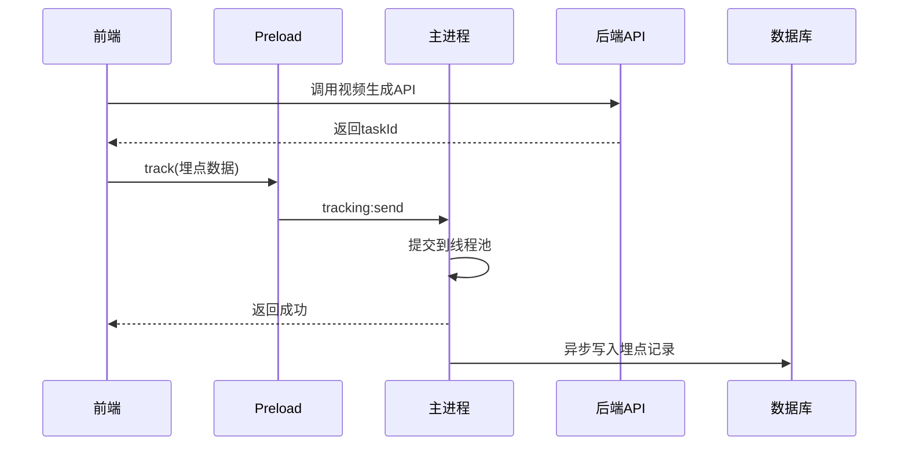

# AI 视频生成埋点记录系统 - 设计文档

## 1. 概述

本系统用于记录用户调用 AI 视频生成模型的行为数据，采用前后端协同的埋点方案。前端负责采集并发送埋点数据，后端通过拦截器捕获关键信息，异步写入数据库。

### 1.1 系统架构

```
┌─────────────┐     ┌─────────────────┐     ┌─────────────────┐
│   前端 React  │ ──▶ │  后端 Spring Boot │ ──▶ │     MySQL       │
│  (埋点采集)   │     │    (拦截器)       │     │  (埋点记录表)    │
└─────────────┘     └─────────────────┘     └─────────────────┘
```

### 1.2 技术选型

| 层级 | 技术方案 | 说明 |
|-----|---------|------|
| 前端框架 | React 19 + TypeScript | 现有项目技术栈 |
| 后端框架 | Spring Boot | 现有项目技术栈 |
| 持久层 | MyBatis-Plus | 现有项目技术栈 |
| 异步处理 | JDK ThreadPoolExecutor | 内置并发工具 |
| 数据库 | MySQL | 现有项目数据库 |

---

## 2. 前端设计

### 2.1 埋点采集模块

**文件位置**: `src/renderer/services/aiVideoTracking.ts` (新建)

**核心职责**:
- 封装埋点数据采集逻辑
- 自动附加用户标识信息
- 参数校验
- 异步发送埋点请求

**接口设计**:

```typescript
// 埋点数据结构
interface AIVideoTrackData {
  userId: string;
  userUuid?: string;
  apiName: string;
  model: string;
  taskId: string;
  prompt?: string;
  provider?: string;
  requestParams?: Record<string, unknown>;
  status: 'SUCCESS' | 'FAIL' | 'PENDING';
  timestamp: number;
}

// 埋点服务类
class AIVideoTrackingService {
  // 采集埋点数据
  track(data: Omit<AIVideoTrackData, 'userId' | 'userUuid' | 'timestamp'>): void;

  // 更新埋点状态（用于异步任务状态更新）
  updateStatus(taskId: string, status: string, errorMessage?: string): void;
}
```

### 2.2 视频生成 API 集成

**修改文件**: `src/renderer/api/aiRequest.ts` 或相关调用位置

**集成方式**:
1. 在视频生成 API 调用成功后，自动触发 `track()` 方法
2. 使用 `taskId` 作为关联键，支持后续状态更新

```typescript
// 示例集成
async function callVideoGenerationAPI(params: VideoGenerationParams) {
  const response = await api.post('/sorotask/v1/video-synthesis', params);

  // 埋点采集
  trackingService.track({
    apiName: '/sorotask/v1/video-synthesis',
    model: params.model,
    taskId: response.data.taskId,
    prompt: params.prompt,
    provider: params.provider,
    requestParams: params,
    status: 'PENDING'
  });

  return response;
}
```

### 2.3 Preload 暴露

**修改文件**: `src/preload/index.ts`

由于埋点请求需要发送到后端，需通过 preload 暴露 API：

```typescript
contextBridge.exposeInMainWorld('api', {
  // ... 现有 API
  tracking: {
    send: (data: AIVideoTrackData) => ipcRenderer.invoke('tracking:send', data),
    updateStatus: (taskId: string, status: string, errorMessage?: string) =>
      ipcRenderer.invoke('tracking:updateStatus', taskId, status, errorMessage)
  }
});
```

---

## 3. 后端设计

### 3.1 拦截器设计

**文件位置**: `src/main/java/com/jike/jjs/interceptor/VideoTrackInterceptor.java` (新建)

**拦截路径**: `/sorotask/v1/*`

**拦截器逻辑**:

```java
@Component
public class VideoTrackInterceptor extends HandlerInterceptorAdapter {

    @Override
    public boolean preHandle(HttpServletRequest request, HttpServletResponse response, Object handler) {
        // 1. 解析请求头中的用户信息 (x-token)
        // 2. 提取请求参数 (model, prompt, taskId 等)
        // 3. 构建埋点数据对象
        // 4. 提交到异步线程池处理
        return true; // 不拦截业务请求
    }
}
```

**注册配置**:

```java
@Configuration
public class WebMvcConfig implements WebMvcConfigurer {

    @Autowired
    private VideoTrackInterceptor videoTrackInterceptor;

    @Override
    public void addInterceptors(InterceptorRegistry registry) {
        registry.addInterceptor(videoTrackInterceptor)
                .addPathPatterns("/sorotask/v1/*");
    }
}
```

### 3.2 异步处理设计

**文件位置**: `src/main/java/com/jike/jjs/config/AsyncConfig.java` (新建或修改)

**线程池配置**:

```java
@Configuration
public class AsyncConfig {

    @Bean(name = "trackingExecutor")
    public ThreadPoolExecutor trackingExecutor() {
        return new ThreadPoolExecutor(
            2,                      // corePoolSize
            4,                      // maximumPoolSize
            60L,                    // keepAliveTime
            TimeUnit.SECONDS,
            new LinkedBlockingQueue<>(1000),
            new ThreadFactoryBuilder()
                .setNameFormat("video-tracking-%d")
                .build(),
            new ThreadPoolExecutor.DiscardPolicy() // 队列满时丢弃，不影响主业务
        );
    }
}
```

**异步服务**:

```java
@Service
public class VideoTrackService {

    @Autowired
    private VideoTrackMapper videoTrackMapper;

    @Async("trackingExecutor")
    public void saveTrackLog(VideoTrackDTO dto) {
        // 异步写入数据库
        videoTrackMapper.insert(dto);
    }
}
```

### 3.3 异常处理策略

| 异常场景 | 处理策略 |
|---------|---------|
| 数据库写入失败 | 记录日志，不抛出异常 |
| 线程池队列满 | 丢弃任务，记录监控指标 |
| 用户未登录 | 跳过埋点，继续业务请求 |
| 请求参数缺失 | 记录日志，标记为 UNKNOWN |

---

## 4. 数据库设计

### 4.1 表结构

```sql
CREATE TABLE `ai_video_track_logs` (
  `id` BIGINT NOT NULL COMMENT '主键，雪花ID',
  `user_id` VARCHAR(64) NOT NULL COMMENT '用户标识',
  `user_uuid` VARCHAR(64) DEFAULT NULL COMMENT '用户UUID',
  `api_name` VARCHAR(256) NOT NULL COMMENT 'API名称',
  `model` VARCHAR(128) NOT NULL COMMENT '模型名称',
  `model_version` VARCHAR(64) DEFAULT NULL COMMENT '模型版本',
  `task_id` VARCHAR(128) NOT NULL COMMENT '任务ID',
  `prompt` TEXT DEFAULT NULL COMMENT '视频描述提示词',
  `provider` VARCHAR(64) DEFAULT NULL COMMENT '服务提供商',
  `request_params` TEXT DEFAULT NULL COMMENT '请求参数JSON',
  `response_task_id` VARCHAR(128) DEFAULT NULL COMMENT '响应返回的task_id',
  `status` VARCHAR(32) NOT NULL COMMENT '状态：SUCCESS/FAIL/PENDING',
  `error_message` TEXT DEFAULT NULL COMMENT '错误信息',
  `create_time` BIGINT NOT NULL COMMENT '创建时间（毫秒时间戳）',
  PRIMARY KEY (`id`),
  INDEX `idx_user_id` (`user_id`),
  INDEX `idx_create_time` (`create_time`),
  INDEX `idx_task_id` (`task_id`)
) ENGINE=InnoDB DEFAULT CHARSET=utf8mb4 COMMENT='AI视频生成埋点记录表';
```

### 4.2 实体类

**文件位置**: `src/main/java/com/jike/jjs/entity/VideoTrackEntity.java` (新建)

```java
@Data
@TableName("ai_video_track_logs")
public class VideoTrackEntity {

    private Long id;
    private String userId;
    private String userUuid;
    private String apiName;
    private String model;
    private String modelVersion;
    private String taskId;
    private String prompt;
    private String provider;
    private String requestParams;
    private String responseTaskId;
    private String status;
    private String errorMessage;
    private Long createTime;
}
```

### 4.3 Mapper

**文件位置**: `src/main/java/com/jike/jjs/mapper/VideoTrackMapper.java` (新建)

```java
@Mapper
public interface VideoTrackMapper extends BaseMapper<VideoTrackEntity> {
}
```

---

## 5. IPC 通道设计

### 5.1 主进程 IPC 处理器

**文件位置**: `src/main/ipc/handler/tracking.ts` (新建)

**通道定义**:

| 通道名 | 方向 | 说明 |
|-------|-----|------|
| `tracking:send` | Renderer → Main | 发送埋点数据 |
| `tracking:updateStatus` | Renderer → Main | 更新任务状态 |

### 5.2 Preload 暴露

**修改文件**: `src/preload/index.ts`

```typescript
contextBridge.exposeInMainWorld('api', {
  // ... existing APIs
  tracking: {
    send: (data: AIVideoTrackData) => ipcRenderer.invoke('tracking:send', data),
    updateStatus: (taskId: string, status: string, errorMessage?: string) =>
      ipcRenderer.invoke('tracking:updateStatus', taskId, status, errorMessage)
  }
});
```

---

## 6. 文件清单

### 6.1 新建文件

| 文件路径 | 说明 |
|---------|------|
| `src/renderer/services/aiVideoTracking.ts` | 前端埋点服务 |
| `src/main/java/com/jike/jjs/interceptor/VideoTrackInterceptor.java` | 后端拦截器 |
| `src/main/java/com/jike/jjs/config/AsyncConfig.java` | 异步线程池配置 |
| `src/main/java/com/jike/jjs/service/VideoTrackService.java` | 埋点业务服务 |
| `src/main/java/com/jike/jjs/entity/VideoTrackEntity.java` | 实体类 |
| `src/main/java/com/jike/jjs/mapper/VideoTrackMapper.java` | Mapper |
| `src/main/java/com/jike/jjs/dto/VideoTrackDTO.java` | DTO |
| `src/main/ipc/handler/tracking.ts` | IPC 处理器 |
| `src/main/resources/mapper/VideoTrackMapper.xml` | MyBatis XML |

### 6.2 修改文件

| 文件路径 | 修改内容 |
|---------|---------|
| `src/preload/index.ts` | 暴露 tracking API |
| `src/main/java/com/jike/jjs/config/WebMvcConfig.java` | 注册拦截器 |
| `src/main/java/com/jike/jjs/ipc/index.ts` | 注册 IPC 通道 |
| `src/renderer/api/aiRequest.ts` | 集成埋点调用 |
| `SQL/ai_video_track_logs.sql` | 创建表 |

---

## 7. 时序图

### 7.1 埋点采集时序



---

## 8. 关键设计决策

| 决策点 | 选择 | 理由 |
|-------|-----|------|
| 前端埋点触发时机 | API调用成功/失败后 | 确保taskId已获取 |
| 异步写入策略 | ThreadPoolExecutor | 轻量级，无需引入MQ |
| 异常处理策略 | 捕获后记录日志 | 不影响主业务 |
| 队列满策略 | DiscardPolicy | 埋点可丢弃，保证业务 |
