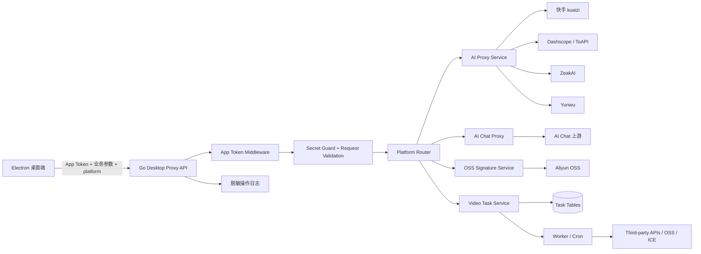
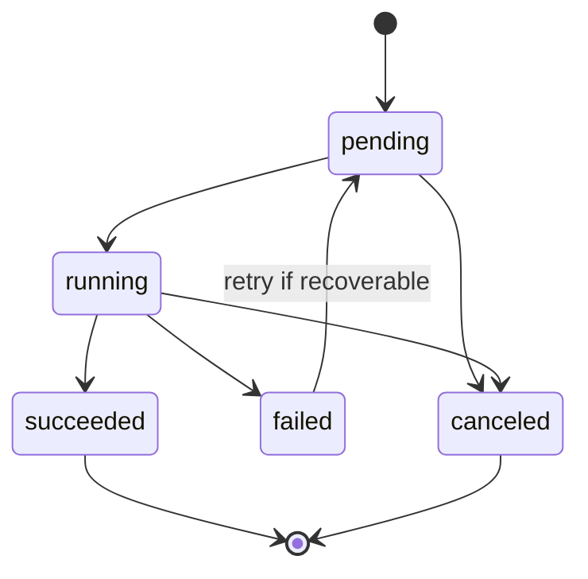
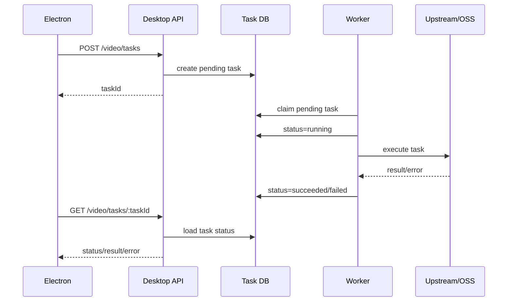

# Secure Go Backend Proxy Design

## Overview

本设计将 Electron 桌面端中第三方 AI、OSS、视频处理、AI Chat 的敏感调用迁移到独立 Go 后端能力层。Go 后端统一保存第三方凭证，并向 Electron 暴露仅面向桌面端的受保护接口。Electron 客户端只保存后端基础地址和基础 App Token，不再保存或处理第三方 API Key、OSS AccessKey Secret、AI Token 或第三方签名逻辑。

设计采用现有 `jike-go` Gin 服务作为承载工程，但新增独立的 Desktop Proxy 领域模块与独立路由前缀，避免复用现有用户 JWT 体系。该模块仅服务 Electron 桌面端，不面向 Web 端，不实现完整用户体系，不包含请求限流能力。

核心目标：

- 后端托管第三方密钥、签名、鉴权 Header 注入和上游请求转发。
- Electron 调用统一后端接口，图片/视频生成请求在现有业务参数基础上附加 `platform`。
- 后端按 `platform` 选择固定上游地址，禁止客户端传入任意上游 URL。
- OSS 上传、访问授权、视频异步任务、AI Chat 都由后端完成安全中转。
- 所有错误响应和日志都进行敏感信息脱敏。
- 任务状态由后端持久化管理，支持查询、失败恢复和幂等控制。

## Research Findings

当前代码调研结论：

1. Electron 侧 AI 请求集中在 `src/service/aiRequest.ts` 和 `src/renderer/api/ai.ts`：当前会为 `ai`、`zeakai`、`kuaizi`、`yunwu`、`dashscope` 等服务设置直连 `baseURL` 并注入 `Authorization`、`ApiKey`、`x-token` 等 Header。
2. Electron 侧 OSS 存在 `ali-oss` 客户端初始化，直接读取 `VITE_OSS_ACCESS_KEY_ID`、`VITE_OSS_ACCESS_KEY_SECRET` 等环境变量。
3. Electron 主进程视频裁剪能力当前读取阿里云 OSS/ICE 凭证，并在本地创建 OSS/ICE 客户端。
4. Go 后端 `jike-go` 已具备 Gin 路由注册、配置加载、zap 日志、MySQL/GORM、Redis、OSS Service、Cron 任务等基础能力。
5. Go 后端现有 AI 路由使用 JWT 登录中间件，不适合直接作为 Electron 桌面端基础认证，需要新增 App Token 中间件。
6. Go 后端已有 `NanoTasks`/`TaskSubs` 一类任务模型和 Cron 处理模式，可作为视频异步任务状态模型和恢复机制的参考，但 Desktop Proxy 任务应保持独立模型边界。

## Architecture

### High-level Architecture



### Deployment Boundary

- Electron 客户端：只包含后端服务地址、App Token、业务参数和 `platform`。
- Go 后端：保存第三方凭证、上游地址映射、OSS 配置、任务数据库配置。
- 第三方平台：只接受 Go 后端发起的请求。

### Route Prefix

新增路由前缀：

```text
/desktop/v1
```

该前缀下所有业务接口使用 App Token 认证，不复用用户登录 JWT。

### Platform Routing

后端仅允许以下固定平台：

| platform | Upstream Base URL |
| --- | --- |
| `kuaizi` | `https://aiopenapi.kuaizi.cn/ai-open-platform-api` |
| `dashscope` | `https://dashscope.aliyuncs.com` |
| `toapi` | `https://dashscope.aliyuncs.com` |
| `zeakai` | `https://zeakai-api.api4midjourney.com` |
| `yunwu` | `https://yunwu.ai` |

设计决策：

- `platform` 必须由客户端传入并通过枚举校验。
- 客户端不得传入完整上游 URL。
- 后端只接受相对 `upstreamPath` 或后端预定义 endpoint key。
- 上游请求路径必须以 `/` 开头，且不得包含 scheme、host、反斜杠、路径穿越片段或控制字符。
- `toapi` 与 `dashscope` 指向相同 baseURL，但可使用独立凭证配置和适配逻辑。

## Components and Interfaces

### Go Backend Modules

建议在 `jike-go` 中新增以下模块：

```text
internal/domain/desktopproxy/
  api.go
  middleware/
    app_token.go
    request_id.go
  logic/
    ai_proxy.go
    chat_proxy.go
    oss_signature.go
    video_task.go
  types/
    request.go
    response.go
    task.go

internal/service/desktopproxy/
  platform_router.go
  upstream_client.go
  credential_provider.go
  sanitizer.go
  operation_logger.go

internal/models/
  desktop_proxy_task.go
  desktop_proxy_operation_log.go
```

### API Surface

#### Authentication

所有 `/desktop/v1` 受保护接口要求 Header：

```http
Authorization: Bearer <APP_TOKEN>
```

也可兼容：

```http
X-App-Token: <APP_TOKEN>
```

校验策略：

- 后端配置可支持多个 App Token，便于轮换。
- 使用常量时间比较，避免 Token 比较时序泄漏。
- 日志只记录 Token 前后少量字符或 Token 哈希摘要，不记录明文。

#### AI Image / Video Generation Proxy

```http
POST /desktop/v1/ai/generation/proxy
```

请求体：

```json
{
  "platform": "dashscope",
  "upstreamPath": "/api/v1/services/aigc/video-generation/video-synthesis",
  "method": "POST",
  "query": {},
  "body": {
    "model": "wanx2.1-t2v-turbo",
    "input": {
      "prompt": "..."
    },
    "parameters": {}
  }
}
```

说明：

- Electron 业务层对图片/视频生成请求新增 `platform` 参数。
- 客户端适配层将现有业务参数放入 `body`，并补充 `platform`、`upstreamPath`、`method`。
- 后端根据 `platform` 注入对应鉴权 Header 或签名参数。
- 后端转发前可按平台规则移除不应传给第三方的本地字段，例如 `platform`、`upstreamPath`。
- 对 Dashscope 视频创建请求，后端负责注入 `X-DashScope-Async: enable`。

#### AI Task Query Proxy

```http
POST /desktop/v1/ai/task/query
```

请求体：

```json
{
  "platform": "kuaizi",
  "upstreamPath": "/v1/video/task/status",
  "method": "POST",
  "body": {
    "task_id": "xxx"
  }
}
```

用于替代客户端当前直接调用快手、Dashscope、ZeakAI 等任务查询接口。

#### AI Chat Proxy

```http
POST /desktop/v1/ai/chat/completions
```

请求体：

```json
{
  "platform": "dashscope",
  "model": "qwen-plus",
  "messages": [],
  "stream": true
}
```

响应模式：

- `stream: false`：返回统一 JSON 结构。
- `stream: true`：后端以 SSE 或兼容现有客户端解析方式转发上游流式响应。
- 上游异常中断时，后端发送脱敏错误事件或结束流并记录日志。

#### OSS Upload Signature

```http
POST /desktop/v1/oss/upload-signature
```

请求体：

```json
{
  "purpose": "canvas-media",
  "fileName": "demo.mp4",
  "contentType": "video/mp4",
  "size": 1048576,
  "publicRead": true
}
```

响应体：

```json
{
  "url": "https://...",
  "method": "PUT",
  "headers": {
    "Content-Type": "video/mp4"
  },
  "objectKey": "desktop/canvas-media/2026/05/...mp4",
  "expiresIn": 120
}
```

限制：

- 后端生成对象 Key，不接受客户端完整 OSS Key。
- 限制 `purpose`、文件类型、文件大小、授权有效期和 ACL。
- 返回最小上传授权，不返回 AccessKey Secret。

#### OSS Access URL

```http
POST /desktop/v1/oss/access-url
```

请求体：

```json
{
  "objectKey": "desktop/canvas-media/2026/05/demo.mp4",
  "publicRead": true,
  "ttlSec": 3600
}
```

用于替代客户端生成或拼接需要签名的 OSS 访问 URL。

#### Video Async Task

```http
POST /desktop/v1/video/tasks
GET /desktop/v1/video/tasks/:taskId
POST /desktop/v1/video/tasks/:taskId/cancel
```

创建任务请求：

```json
{
  "taskType": "trim",
  "idempotencyKey": "optional-client-generated-key",
  "input": {
    "videoUrl": "https://...",
    "start": 1.2,
    "end": 8.6
  }
}
```

任务状态响应：

```json
{
  "taskId": "123",
  "status": "running",
  "progress": 40,
  "result": null,
  "error": null,
  "createdAt": "2026-05-06T00:00:00Z",
  "updatedAt": "2026-05-06T00:00:03Z"
}
```

状态机：



### Electron Client Changes

客户端新增 `src/renderer/api/desktopProxy.ts` 或等价 API 封装：

- 从配置读取 Go 后端 baseURL。
- 请求后端时注入 App Token。
- 为图片/视频生成函数新增 `platform` 参数。
- 将当前第三方直连 API 包装为后端代理调用。
- 移除第三方 Token、OSS Secret、上游鉴权 Header 的客户端读取和注入逻辑。

迁移目标：

- `createImageGeneration`、`createAdobe2ApiImageGeneration`、`createAdobe2ApiVideoGeneration`、`createLzVideoTask`、`getLzVideoTaskStatus`、`createDashscopeVideoSynthesis`、`getDashscopeVideoTaskStatus`、`submitMjImagine`、`fetchMjTask`、`generateGeminiContent`、`createChatCompletion` 等统一改为调用 Go 后端。
- `src/service/oss.ts` 不再初始化 `ali-oss` 客户端，不再读取 `VITE_OSS_ACCESS_KEY_SECRET`。
- `src/main/ipc/video-processing/service.ts` 不再读取阿里云 AccessKey，不再本地创建 OSS/ICE 客户端。
- `vite.config.ts` 中开发代理仅保留必要的后端服务代理，不再代理第三方 AI 服务。

## Data Models

### Config Models

新增 Go 配置结构：

```go
type DesktopProxyConfig struct {
    Enabled bool
    AppTokens []string
    RequestTimeoutSec int
    Platforms map[string]PlatformConfig
    OSS DesktopOSSConfig
    Task DesktopTaskConfig
}

type PlatformConfig struct {
    BaseURL string
    AuthType string
    APIKey string
    BearerToken string
    Headers map[string]string
    TimeoutSec int
}

type DesktopOSSConfig struct {
    UploadTTLSeconds int
    AccessTTLSeconds int
    MaxFileSizeBytes int64
    AllowedContentTypes []string
    KeyPrefix string
}

type DesktopTaskConfig struct {
    WorkerConcurrency int
    RecoverPolicy string
    MaxRetry int
}
```

配置来源：

- 本地 YAML 可保留非敏感默认项。
- 第三方密钥、App Token、OSS Secret 优先通过环境变量注入。
- 启动时校验必需配置，错误信息脱敏。

### Task Model

```go
type DesktopProxyTask struct {
    BaseModel
    TaskID string
    TaskType string
    IdempotencyKey string
    Platform string
    Status string
    Progress int
    InputJSON json.RawMessage
    ResultJSON json.RawMessage
    ErrorCode string
    ErrorMessage string
    RetryCount int
    Recoverable bool
    StartedAt *time.Time
    FinishedAt *time.Time
}
```

唯一约束：

- `task_id` 唯一。
- `idempotency_key` 可选；存在时与 `task_type` 组合唯一。

### Operation Log Model

```go
type DesktopProxyOperationLog struct {
    BaseModel
    RequestID string
    TaskID string
    Platform string
    Operation string
    Method string
    UpstreamPath string
    StatusCode int
    DurationMs int64
    ErrorCode string
    ErrorSummary string
}
```

日志模型不保存完整请求体、完整响应体、Token、API Key、签名 URL 查询参数或 Authorization Header。

## Security Design

### Secret Ownership

第三方凭证只存在于 Go 后端配置中：

- AI Token / API Key
- OSS AccessKey ID / Secret
- 阿里云 ICE / VOD 凭证
- 第三方平台自定义 Header 凭证

Electron 客户端禁止保存：

- `VITE_OSS_ACCESS_KEY_SECRET`
- 第三方 `Authorization` Token
- `ApiKey` Header 值
- 签名密钥或可长期复用凭证

### Secret Guard

后端在受保护接口入口检查客户端请求中是否携带疑似敏感字段：

- 字段名包含 `api_key`、`apikey`、`access_key`、`accesskey`、`secret`、`token`、`authorization`、`signature`。
- 允许字段白名单：`App Token` 所在 Header、业务含义明确且非第三方凭证的短生命周期字段。
- 命中高风险字段时拒绝请求并记录脱敏日志。

### SSRF Protection

虽然后端采用请求透传，但不接受任意目标 URL：

- 上游 baseURL 只能来自后端平台枚举配置。
- `upstreamPath` 必须是相对路径。
- 禁止 `http://`、`https://`、`//host`、`..`、反斜杠和控制字符。
- 可按平台维护允许路径前缀，逐步从宽松迁移到严格白名单。

### Error Sanitization

统一脱敏规则：

- Header：`Authorization`、`ApiKey`、`x-api-key`、`x-token`、`X-App-Token` 全量替换为 `***`。
- Query：`Signature`、`OSSAccessKeyId`、`Expires`、`token`、`api_key` 替换为 `***`。
- JSON 字段：`secret`、`token`、`key`、`authorization`、`signature` 等按字段名脱敏。
- 上游错误只返回错误分类、平台、请求 ID 和用户可理解摘要。

## Error Handling

统一响应结构沿用现有 Go 后端 `ResponseData` 思路：

```json
{
  "code": 502,
  "msg": "upstream service unavailable",
  "modal": false,
  "data": null,
  "timestamp": 1778000000,
  "requestId": "req_xxx"
}
```

错误分类：

| Code | Meaning | Client Behavior |
| --- | --- | --- |
| `400` | 参数错误或非法 platform | 展示参数错误 |
| `401` | App Token 缺失或无效 | 提示认证失败 |
| `403` | 请求包含禁止字段或路径不允许 | 提示请求被拒绝 |
| `502` | 上游服务错误 | 展示上游服务暂不可用 |
| `504` | 上游超时 | 展示请求超时，可重试 |
| `500` | 后端内部错误 | 展示通用错误 |

设计决策：

- 对普通 JSON 接口，HTTP 状态码与 `code` 保持一致。
- 如果需要兼容现有 `common.ResponsePlain`，可先保持 JSON 结构一致，再逐步调整客户端拦截器。
- 流式 Chat 接口在响应已开始后出现错误时，使用 SSE error event 返回脱敏错误摘要。
- 后端日志记录完整排查上下文，但必须先经过脱敏器。

## Task Processing and Recovery

视频异步任务由数据库持久化，Worker 或 Cron 负责执行。

处理流程：



恢复策略：

- 服务启动时扫描 `running` 且更新时间超过阈值的任务。
- 可恢复任务按 `RecoverPolicy` 重新置为 `pending` 或 `failed`。
- 不可幂等的上游提交任务不得自动重复提交，除非已有第三方任务 ID 可用于查询。
- 每次任务状态变更记录操作日志。

## Testing Strategy

### Unit Tests

- `platform_router`：校验 platform 到 baseURL 的映射、非法 platform、非法路径拦截。
- `app_token`：校验缺失、错误、正确 Token，以及脱敏日志输出。
- `sanitizer`：校验 Header、Query、JSON、上游错误的脱敏规则。
- `oss_signature`：校验文件类型、大小、Key 前缀、TTL 和最小授权返回。

### Integration Tests

- 使用 mock upstream 验证后端是否正确注入平台鉴权 Header。
- 验证图片/视频生成代理是否保留业务参数并剥离本地控制字段。
- 验证 Chat 非流式和流式响应转发。
- 验证视频任务创建、查询、失败、取消和恢复状态流转。

### Electron Adapter Verification

- 检查 Electron 构建相关代码不再读取第三方 Token、OSS Secret 或上游 API Key。
- 检查 AI、OSS、视频裁剪、AI Chat 调用路径全部指向 Go 后端。
- 检查 `platform` 在图片/视频生成请求中被传递到后端。

## Migration Plan

1. 在 Go 后端新增 Desktop Proxy 配置、App Token 中间件和 `/desktop/v1` 路由。
2. 实现平台路由、上游 HTTP Client、凭证注入和脱敏日志。
3. 实现 AI 图片/视频生成代理和任务查询代理。
4. 实现 AI Chat 非流式与流式代理。
5. 实现 OSS 上传签名和访问 URL 接口。
6. 实现视频异步任务模型、任务创建、查询、取消和 Worker 恢复机制。
7. Electron 新增后端代理 API 封装，并逐步替换第三方直连调用。
8. 删除或停用客户端侧第三方密钥读取、OSS 客户端初始化、阿里云 ICE/OSS 本地客户端和 Vite 第三方代理配置。

## Design Decisions and Rationales

| Decision | Rationale |
| --- | --- |
| 使用 `/desktop/v1` 独立前缀 | 与现有用户端和后台接口隔离，便于安全策略和后续维护 |
| 使用 App Token 而非用户 JWT | 需求明确无需完整用户体系，Electron 只需基础服务认证 |
| 后端固定平台 baseURL | 避免客户端传入任意 URL 造成 SSRF 风险 |
| 平台请求透传但保留路径校验 | 保持迁移成本低，同时避免完全开放代理 |
| OSS 返回短期签名而非密钥 | 满足上传需求并避免泄露 AccessKey Secret |
| 视频任务持久化 | 支持长耗时任务查询、失败恢复和服务重启后的状态管理 |
| 日志先脱敏后记录 | 兼顾排查能力和敏感信息保护 |
| 不设计请求限流 | 已根据需求调整，当前范围不包含限流能力 |
