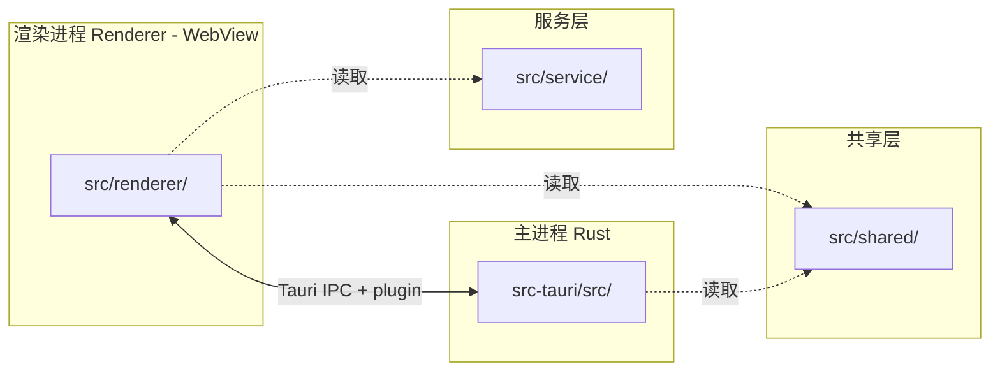

# CLAUDE.md

> 即刻（jike）—— 基于 **Tauri 2 + React 19 + TypeScript 5.9** 的桌面端视频工作流工具。
> 本文档聚焦项目目录结构与组织约束，不涉及具体业务实现。

---

## 1. 项目速览

| 项目 | 内容 |
| --- | --- |
| 项目名称 | 即刻（`jike`） |
| 技术栈 | Tauri 2 / React 19 / TypeScript 5.9 / Vite 7 / Tailwind v4 / Zustand |
| 渲染进程 | `src/renderer/`（WebView，React SPA） |
| 主进程 | `src-tauri/src/`（Rust，业务与系统能力） |
| 共享层 | `src/shared/`（渲染 + Rust 共用的类型 / 常量 / 纯函数） |
| 服务层 | `src/service/`（仅渲染进程：本地存储、网络、OSS 等基础设施封装） |

---

## 2. 顶层目录结构

```text
jike/
├── CLAUDE.md                # 当前文档：项目目录结构与 AI 协作指南
├── index.html               # Vite 入口 HTML
├── package.json             # 前端依赖与脚本
├── package-lock.json
├── tsconfig.json            # TS 项目引用（app / node）
├── tsconfig.app.json        # 渲染进程 TS 配置（含路径别名）
├── tsconfig.node.json       # Vite/Node 侧 TS 配置
├── vite.config.ts           # Vite + Tauri 构建配置（含 manualChunks 关键修复）
├── .env / .env.docker       # 环境变量（已 .gitignore，由 .env.example 共享变量名）
├── .editorconfig / .prettierrc / .prettierignore / .npmrc
├── .vscode/                 # 编辑器配置
├── .github/                 # Issue / PR 模板、Copilot 指令
│
├── docs/                    # 结构规范、踩坑记录、模块说明
│   ├── FPS Drop/            # FPS 性能排查
│   ├── ImageTile/           # 图像瓦片化方案
│   └── Pane/                # 面板 / 分屏布局
│
├── public/                  # 静态资源（不经 import，URL 直访）
├── resources/               # 桌面端资源
│   ├── certs/               # 开发期证书
│   └── icons/               # 共享图标
│
├── src/                     # 渲染进程 + 共享 + 服务层源码
│   ├── renderer/            # React 应用本体
│   ├── shared/              # 跨进程共享（类型 / 常量 / 纯函数）
│   └── service/             # 渲染进程基础设施封装
│
└── src-tauri/               # Rust 主进程 + Tauri 配置
    ├── Cargo.toml / Cargo.lock
    ├── build.rs
    ├── tauri.conf.json      # Tauri 2 应用配置
    ├── capabilities/        # Tauri 2 ACL 权限声明
    ├── gen/                 # Tauri CLI 自动生成（勿手动编辑）
    ├── icons/               # 打包用多尺寸图标
    ├── src/                 # Rust 源码（main / lib / commands / domain / models）
    └── target/              # Rust 构建产物
```

---

## 3. 路径别名

在 `tsconfig.app.json` 与 `vite.config.ts` 中同步声明，跨模块 `import` 必须使用别名：

| 别名 | 实际路径 | 适用场景 |
| --- | --- | --- |
| `@/*` | `src/renderer/*` | 渲染进程内部互引 |
| `shared/*` | `src/shared/*` | 跨进程共享类型 / 常量 / 工具 |
| `service/*` | `src/service/*` | 渲染进程内的本地存储与网络封装 |

> 特例允许相对路径：同目录 `index.ts` 桶内部、组件与同级 `*.module.css`、`import` 静态资源。

---

## 4. 进程模型与分层约束

### 4.1 进程模型



- **渲染进程**：React 应用本体，运行在 WebView 中。
- **主进程（Rust）**：系统能力、文件、下载、追踪、托盘等。
- **共享层**：`src/shared/`，渲染 + Rust 共用；禁止引用 `window`、`document`、`@tauri-apps/*`、`react`。
- **服务层**：`src/service/`，仅由渲染进程调用的本地存储 / 网络 / AI / OSS 封装；禁止反向依赖 `src/renderer/components/**`。

### 4.2 分层职责速查

| 目录 | 进程 | 放什么 | 不允许放 |
| --- | --- | --- | --- |
| `src/renderer/` | 渲染 | React 应用本体（页面、组件、Hook、Store、API、Service） | 跨进程共享类型（→ `src/shared/`） |
| `src/renderer/api/` | 渲染 | 外部 HTTP 接口封装（按后端域名命名） | UI 状态、IPC 命令 |
| `src/renderer/services/` | 渲染 | 渲染 ↔ Rust 的桥接、IPC 封装、长连接 | React 状态 |
| `src/renderer/stores/` | 渲染 | Zustand 等全局状态（`*Store.ts`） | 业务逻辑实现 |
| `src/renderer/hooks/` | 渲染 | `use*` 自定义 React Hook | 组件 JSX |
| `src/renderer/components/ui/` | 渲染 | shadcn/ui 基础组件（kebab-case，无业务） | 业务逻辑 |
| `src/renderer/pages/<Page>/` | 渲染 | 路由级页面（一个目录一个路由） | 跨页复用组件（应上浮到 `components/`） |
| `src/service/` | 渲染 | 本地存储、OSS、AI 请求等基础设施封装 | 反向依赖 `src/renderer/components/**` |
| `src/shared/constants/` | 共享 | 跨进程枚举、预设、接口域名 | `window`/`document`/Tauri API/React |
| `src/shared/types/` | 共享 | 跨进程类型 / DTO | 函数、类、含副作用的代码 |
| `src/shared/utils/` | 共享 | 纯函数工具（媒体、画布、归一化等） | `localStorage`、Tauri API |
| `src-tauri/src/commands/` | Rust | `#[tauri::command]` 入口，薄壳转发到 `domain/` | 业务实现细节 |
| `src-tauri/src/domain/` | Rust | 业务实现层，可单测 | 直接调用 Tauri API |
| `src-tauri/src/models/` | Rust | 仅 `struct`/`enum` + `serde` | 业务逻辑 |
| `src-tauri/capabilities/` | Rust | Tauri 2 ACL 权限声明 | 业务代码 |
| `src-tauri/gen/` | Rust | Tauri CLI 自动生成 | 手动编辑 |
| `public/` | 静态 | 不经 import 的 URL 直访资源（favicon、社交图） | 业务数据 JSON（→ `shared/constants/`） |
| `src/renderer/assets/` | 静态 | 被 `import` 的图片 / 字体 / SVG | 仅 URL 访问的资源（→ `public/`） |
| `docs/` | 文档 | 结构规范、踩坑记录、模块说明 | 代码与配置文件 |
| `resources/certs/` `resources/icons/` | 资源 | 开发期证书、共享图标 | 私钥 |

---

## 5. 前端 React 目录（`src/renderer/`）

```text
src/renderer/
├── App.tsx                  # 应用根组件
├── main.tsx                 # React 入口（挂载根节点、Provider）
├── env.d.ts                 # Vite 环境变量声明
├── index.css                # 全局样式（Tailwind v4 入口）
│
├── api/                     # 外部 HTTP 接口封装（按后端域名命名）
│                             #   agnes.ts / ai.ts / jikeGo.ts / jikeing.ts / wuhen.ts
│
├── assets/                  # 被 import 的图片 / 字体 / SVG
│
├── components/              # 跨页面复用组件（PascalCase）
│   ├── ui/                  # shadcn/ui 基础组件（kebab-case，无业务）
│   │   ├── button.tsx / command.tsx / context-menu.tsx / dialog.tsx
│   │   ├── drawer.tsx / dropdown-menu.tsx / input.tsx / input-group.tsx
│   │   ├── modal.tsx / popover.tsx / select.tsx / skeleton.tsx
│   │   ├── slider.tsx / switch.tsx / textarea.tsx / toastContainer.tsx
│   │   ├── tooltip.tsx / video-player.tsx
│   ├── base-handle.tsx / button-handle.tsx
│   ├── CinematicProjectLoader.tsx / ModelPointsBadge.tsx / ModelSelector.tsx
│   ├── node-search.tsx / PresetDropdown.tsx / ProjectDialog.tsx
│   ├── ThumbnailPreviewPopover.tsx
│   └── panorama/            # 全景图相关子组件
│       ├── PanoramaCanvas.tsx
│       ├── PanoramaControls.tsx
│       ├── PanoramaLoading.tsx
│       └── PanoramaViewer.tsx
│
├── hooks/                   # use* 自定义 React Hook
│                             #   useAgentExecution / useCanvasChat / useChatHistory
│                             #   useCopyPaste / useGenerationPoints
│                             #   useMessage / useNodeScale / useQrcodePolling
│                             #   useResizableWidth / useUndoRedo / useVideoEnhanceTask
│
├── pages/                   # 路由级页面（一个目录一个路由）
│   ├── Assets/              # 资产
│   ├── Canvas/              # 节点画布（核心）
│   ├── CanvasPlaceholder/   # 画布占位（仅开发期）
│   ├── Home/                # 首页
│   ├── Login/               # 登录
│   ├── Points/              # 积分
│   ├── Profile/             # 个人中心
│   ├── Script/              # 脚本
│   ├── Sidebar/             # 侧边栏
│   ├── Test/                # 测试页（仅开发期）
│   ├── TestGo/              # 测试页（仅开发期）
│   ├── Video/               # 视频
│   └── Voice/               # 语音
│
├── router/                  # 路由表
│   └── index.tsx
│
├── services/                # 渲染 ↔ Rust 的桥接、IPC 封装、长连接
│   ├── ipcService.ts        # Tauri command 统一封装入口
│   ├── tauri-bridge.ts      # 渲染 ↔ Rust 桥接
│   ├── aiVideoEnhanceTracking.ts / aiVideoTracking.ts
│   └── canvasChatImageGeneration.ts
│
├── stores/                  # Zustand 全局状态（*Store.ts）
│   ├── announcementStore.ts
│   ├── canvasFlowStore.ts
│   ├── chatSettingsStore.ts
│   └── useUserStore.ts
│
├── types/                   # 渲染进程内部类型扩展
│   └── react-window.d.ts
│
└── utils/                   # 渲染进程内部工具
    ├── canvasHistoryBridge.ts
    └── generationNotification.ts
```

### 5.1 渲染进程关键约定

- **组件**：`src/renderer/components/ui/` 内的 shadcn 组件保持 **kebab-case**；其它业务组件一律 **PascalCase**。
- **页面**：`src/renderer/pages/<Page>/` 一个目录一个路由；DevTools / Test / TestGo / CanvasPlaceholder 等开发期页面 **禁止注册到正式路由表**，仅在 `import.meta.env.DEV` 或 `?dev=1` 开关下出现。
- **样式 / 静态资源**：被 `import` 的资源放 `src/renderer/assets/`；仅 URL 直访的放 `public/`。
- **入口**：`src/renderer/main.tsx` 挂载根节点；`App.tsx` 装配全局 Provider 与 Router。

---

## 6. Tauri 后端目录（`src-tauri/`）

```text
src-tauri/
├── Cargo.toml               # crate 元数据 / 依赖 / release profile
├── Cargo.lock
├── build.rs                 # tauri-build 构建脚本
├── tauri.conf.json          # Tauri 2 应用配置
│
├── capabilities/
│   └── default.json         # 主窗口 default 能力集
│
├── gen/                     # Tauri CLI 自动生成（含 desktop-schema.json）
│   └── schemas/
│
├── icons/                   # 打包用多尺寸图标
│   ├── 32x32.png / 128x128.png / 128x128@2x.png
│   ├── icon.icns / icon.ico / icon.png
│
├── src/
│   ├── main.rs              # 二进制入口
│   ├── lib.rs               # 库入口（crate-type = ["staticlib","cdylib","rlib"]）
│   ├── commands/            # #[tauri::command] 入口，薄壳转发到 domain/
│   │   ├── mod.rs
│   │   ├── debug.rs / download.rs / notification.rs / storage.rs
│   │   ├── tracking.rs / tray.rs / video.rs
│   ├── domain/              # 业务实现层（可单测，不直接调用 Tauri API）
│   │   ├── mod.rs
│   │   ├── download_service.rs / storage_service.rs / tracking_service.rs
│   │   ├── tray_service.rs / video_service.rs
│   └── models/              # 仅 struct/enum + serde
│       ├── mod.rs
│       ├── media.rs / storage.rs / tracking.rs / video.rs
│
└── target/                  # Rust 构建产物
```

### 6.1 Rust 分层约束

- `src-tauri/src/commands/`：**薄壳层**，仅做参数透传 / 错误包装 / 调用 `domain/`。
- `src-tauri/src/domain/`：**业务实现**，不直接依赖 Tauri API，方便单测。
- `src-tauri/src/models/`：**DTO 与领域模型**，仅 `struct` / `enum` + `serde` 派生，不写业务逻辑。
- `src-tauri/capabilities/`：Tauri 2 ACL 声明。新增 `#[tauri::command]` 后必须在此同步声明权限。
- `src-tauri/gen/`：**禁止手动编辑**。

### 6.2 跨进程类型同步流程

1. 跨进程类型 / 枚举 / 常量 **必须** 放在 `src/shared/`，禁止在 Rust 与 TS 两侧重复定义。
2. 新增 `#[tauri::command]` 后必须：
   1. 在 `src-tauri/capabilities/default.json` 中声明 ACL；
   2. 在 `src/renderer/services/ipcService.ts` 封装调用入口；
   3. 在 `src-tauri/src/commands/mod.rs` 中导出；
   4. 业务实现放进 `src-tauri/src/domain/`，`commands/` 仅做薄壳转发。

---

## 7. 共享层（`src/shared/`）

```text
src/shared/
├── constants/               # 跨进程枚举、预设、接口域名
│                             #   agent-presets.ts / ai-models.ts / apiEndpoints.ts
│                             #   canvasDrag.ts / chat-personas.ts / enum.ts
│                             #   image-agent-presets.ts / mediaTypes.ts
│                             #   modelPoints.ts / points.ts / system-prompts.ts
│                             #   text-agent-presets.ts / video-agent-presets.ts
│                             #   ...
├── types/                   # 跨进程 DTO / 类型
└── utils/                   # 纯函数工具（媒体、画布、归一化等）
```

**约束**：

- 不得引用 `window` / `document` / `@tauri-apps/*` / `react`。
- 不得使用 `localStorage` / `IndexedDB` / DOM API。
- 仅放纯类型、枚举、纯函数；含副作用的代码下沉到 `src/service/`。

---

## 8. 服务层（`src/service/`）

```text
src/service/
├── aiRequest.ts             # AI 请求封装
├── assetStorage.ts          # 资产本地存储
├── chatHistoryStorage.ts    # 聊天历史持久化
├── localStorageService.ts   # localStorage 封装
├── oss.ts                   # 阿里云 OSS 上传封装
├── projectStorage.ts        # 项目数据持久化
└── storyboardStorage.ts     # 分镜数据持久化
```

**约束**：

- 仅由渲染进程调用；通过 `service/*` 别名访问。
- 不得反向依赖 `src/renderer/components/**`；上层 UI 通过 Hook / Store 组合。

---

## 9. 新文件落位判定（AI 代理必须遵循）

按以下顺序判断：

1. **仅 Rust 使用？** → `src-tauri/src/{models|domain|commands}/`
2. **Rust + 渲染共用？** → `src/shared/{types|constants|utils}/`
3. **依赖 React/DOM/Tauri，渲染进程内部共用？** → `src/renderer/{hooks|services|stores|utils}/`
4. **跨页面复用组件？** → `src/renderer/components/`
5. **页面私有？** → `src/renderer/pages/<Page>/components/`
6. **样式 / 静态资源？** → `src/renderer/assets/`（被 import）或 `public/`（URL 直访）
7. **本地存储 / 网络封装？** → `src/service/`

> 原则："**先下沉，再上浮**"。模糊地带先放进 `shared/`，依赖收紧后再上移到 `renderer/` 或 `service/`。

---

## 10. 命名规范

| 类型 | 风格 | 示例 |
| --- | --- | --- |
| 业务模块目录 | PascalCase | `Canvas/`、`CustomNodes/` |
| React 组件文件 | PascalCase `.tsx` | `CanvasFlow.tsx` |
| Hook 文件 | camelCase `use*.ts(x)` | `useUndoRedo.ts` |
| Store 文件 | camelCase `*Store.ts` | `canvasFlowStore.ts` |
| API / Service 文件 | camelCase `.ts` | `jikeGo.ts` |
| 工具文件 | camelCase `.ts` | `imageCompress.ts` |
| 类型文件 | PascalCase `.ts` | `VideoGeneration.ts` |
| Rust 文件 | snake_case `.rs` | `download_service.rs` |
| 常量 | UPPER_SNAKE_CASE | `MAX_RETRY_ATTEMPTS` |
| shadcn 组件 | kebab-case | `command.tsx` |
| 文档目录 / 文件 | PascalCase 目录 + kebab-case 文件 | `FPS Drop/fps-tracing.md` |

> `src/renderer/components/ui/` 内的 shadcn 组件保持 kebab-case；其它业务组件一律 PascalCase。

---

## 11. 跨进程类型同步

- 跨进程类型 / 枚举 / 常量 **必须** 放在 `src/shared/`，禁止在 Rust 与 TS 两侧重复定义。
- 新增 `#[tauri::command]` 后必须：
  1. 在 `src-tauri/capabilities/default.json` 中声明 ACL；
  2. 在 `src/renderer/services/ipcService.ts` 封装调用入口；
  3. 在 `src-tauri/src/commands/mod.rs` 中导出；
  4. 业务实现放进 `src-tauri/src/domain/`，`commands/` 仅做薄壳转发。

---

## 12. 任务验证

- 每完成一个任务后，都需运行 `npm run build 2>&1 | Select-Object -Last 150` 验证构建是否通过。
- 验证过程中可忽略 Tailwind CSS 的样式警告，其它错误必须修复。
